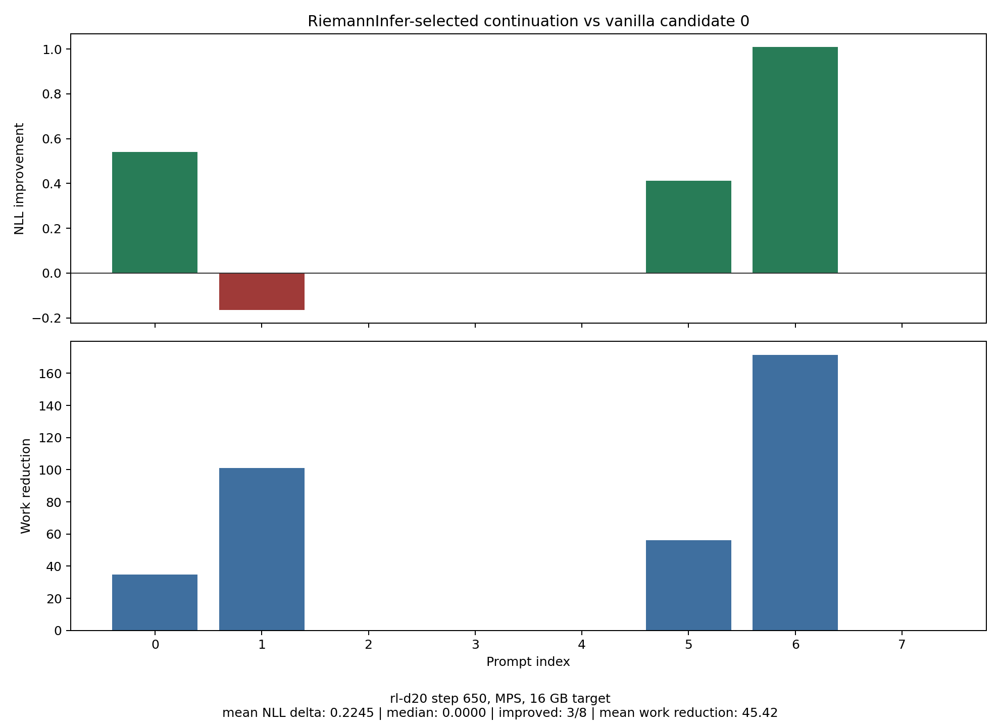

# Riemann Transformer

Riemann Transformer is a small experimental fork of [nanochat](https://github.com/karpathy/nanochat) that adds a Riemannian-geometry-guided inference path inspired by Mao et al., ["RiemannInfer: improving transformer inference through Riemannian geometry"](https://www.nature.com/articles/s41598-026-37328-x). The original nanochat project supplies almost all of the training, checkpoint loading, tokenizer, evaluation, and inference infrastructure; this repository layers a RiemannInfer-style candidate selector and comparison plot on top of it.

The experiment here is not a reproduction of the paper's full benchmark suite. It is a compact, Mac-friendly demonstration that asks whether the RiemannInfer work score can pick a better continuation from a small candidate pool on a pretrained nanochat RL checkpoint.

## What Changed

- `nanochat/riemann_infer.py` implements the RiemannInfer pipeline:
  - extracts hidden states and attention weights,
  - reduces hidden states with UMAP, falling back to PCA if UMAP is unavailable,
  - constructs an attention-induced Riemannian metric,
  - computes curvature and path work,
  - selects the candidate with minimum reasoning work.
- `nanochat/gpt.py` adds an introspection path, `forward_with_intermediates`, that returns per-layer hidden states and attention matrices.
- `scripts/riemann_infer_cli.py` provides an interactive CLI for RiemannInfer-selected generation.
- `scripts/riemann_compare_plot.py` downloads the pretrained RL checkpoint, runs a fixed comparison against vanilla generation, writes a CSV, and saves the figure below.
- `nanochat/checkpoint_manager.py` tolerates RL checkpoint metadata fields such as `chat_template`, `bos_token`, `eos_token`, and `pad_token` when constructing `GPTConfig`.

## Comparison Result



The figure compares vanilla generation against RiemannInfer-selected generation on the same candidate pool.

- **X-axis:** prompt index from the fixed 8-prompt evaluation set in `scripts/riemann_compare_plot.py`.
- **Top Y-axis:** length-normalized negative log-likelihood improvement, computed as `NLL(vanilla candidate 0) - NLL(RiemannInfer selected candidate)`. Positive bars mean the RiemannInfer-selected continuation had lower model NLL than the vanilla first candidate.
- **Bottom Y-axis:** RiemannInfer work reduction, computed as `work(vanilla candidate 0) - work(RiemannInfer selected candidate)`. Positive bars mean the selected continuation had lower Riemannian path work, which is the selector's direct objective.
- **Caption statistics:** mean/median NLL delta, number of prompts improved, mean work reduction, checkpoint, and device target.

The run that produced the checked-in figure used:

| Setting | Value |
|---|---|
| Checkpoint | `nanochat-students/rl-d20` |
| Local source | `chatrl_checkpoints/d20`, step `650` |
| Device | Apple Silicon MPS |
| Memory target | 16 GB unified memory |
| Prompts | 8 fixed prompts |
| Candidates per prompt | 3 |
| Max generated tokens | 32 |
| Temperature | 0.8 |
| Top-k | 50 |
| Seed | 42 |
| Riemann analysis layer | final hidden layer |
| Path planner | sequential path, no Dijkstra |
| Dimensionality reduction | UMAP when installed; PCA fallback otherwise |

For this run, RiemannInfer improved the NLL proxy on 3 of 8 prompts, with mean NLL delta `0.2245`, median NLL delta `0.0`, and mean work reduction `45.42`. The raw rows are in [`outputs/riemann_compare_rl_d20/results.csv`](outputs/riemann_compare_rl_d20/results.csv).

## Setup

This repository keeps nanochat's dependency style. A typical CPU/MPS setup is:

```bash
uv sync --extra cpu --group dev
source .venv/bin/activate
```

The local environment used for the checked-in run had Python 3.12, PyTorch with MPS support, `matplotlib`, `numpy`, and `umap-learn` installed. If `umap-learn` is missing, the RiemannInfer code falls back to PCA for the comparison script.

## Usage

Run the smoke test first:

```bash
PYTORCH_MPS_HIGH_WATERMARK_RATIO=0.0 \
python -m scripts.riemann_compare_plot \
  --limit-prompts 2 \
  --num-candidates 2 \
  --max-tokens 8
```

Then run the full default comparison:

```bash
PYTORCH_MPS_HIGH_WATERMARK_RATIO=0.0 \
python -m scripts.riemann_compare_plot
```

The script downloads these files from [`nanochat-students/rl-d20`](https://huggingface.co/nanochat-students/rl-d20) on first run:

- `model_000650.pt`
- `meta_000650.json`
- `tokenizer.pkl`
- `token_bytes.pt`

Model files are placed under `~/.cache/nanochat/chatrl_checkpoints/d20/`. Tokenizer files are installed under `~/.cache/nanochat/tokenizer/`; existing tokenizer files are backed up as `*.bak_pre_rl_d20` before replacement because this RL checkpoint uses a 65,536-token vocabulary.

To skip download checks after the checkpoint is installed:

```bash
PYTORCH_MPS_HIGH_WATERMARK_RATIO=0.0 \
python -m scripts.riemann_compare_plot --skip-download
```

Interactive RiemannInfer generation:

```bash
PYTORCH_MPS_HIGH_WATERMARK_RATIO=0.0 \
python -m scripts.riemann_infer_cli \
  --source rl \
  --model-tag d20 \
  --step 650 \
  --device-type mps \
  --candidates 3 \
  --max-tokens 64 \
  --prompt "Explain why the sky is blue."
```

## Notes and Limitations

- The comparison metric is a proxy. RiemannInfer optimizes path work, while the plotted quality proxy is length-normalized model NLL of the selected continuation.
- The experiment uses short generations and a small candidate pool to fit comfortably on an M3-class 16 GB machine.
- The first full run spends most of its time downloading and loading the 1.9 GB checkpoint. Subsequent runs can use `--skip-download`.
- This repository is heavily based on nanochat. For the original full-stack training and chat system, use [karpathy/nanochat](https://github.com/karpathy/nanochat).

## Discussion

The current implementation should be interpreted as a candidate re-ranker, not as a faster decoder. It is slower than vanilla single-sample generation in wall-clock time because it first samples multiple continuations, then runs additional introspection and geometry scoring passes over each candidate. The "work reduction" in the plot means lower estimated Riemannian path work inside the model's representation space; it is not a latency measurement.

The useful signal is that the minimum-work candidate sometimes also has lower length-normalized model NLL. A cautious reading is that smoother hidden-state trajectories under the attention-induced geometry can correlate with continuations the model itself assigns higher probability to. In this experiment, RiemannInfer reduced the NLL proxy on 3 of 8 prompts and selected lower-work continuations whenever it chose a non-vanilla candidate. That is evidence for a geometric re-ranking signal, not proof that the method generally improves factuality, reasoning, or runtime.

UMAP is used as a dimensionality-reduction step before graph construction. Transformer hidden states are high-dimensional, so the implementation projects token hidden states into a smaller coordinate system while trying to preserve local neighborhoods. If `umap-learn` is unavailable, the code falls back to PCA. This makes the geometry computation cheaper and more stable, but it also means the graph is built on an approximation of the model's representation geometry rather than the full hidden space.

Curvature is computed heuristically from attention entropy. For each token position, the implementation looks at the attention distribution, computes its entropy, normalizes it, and maps lower entropy to higher curvature. The intuition is that sharply concentrated attention corresponds to a more constrained or curved representational region, while diffuse attention corresponds to a flatter region. This is not a full differential-geometry scalar-curvature calculation; it is a torch/NumPy-friendly proxy inspired by the RiemannInfer framing.

Once hidden states, attention-derived metrics, and curvature gradients are available, the code can assign graph edge costs. The approximate edge work is:

```text
work = geodesic_distance * (1 + alpha * abs(curvature_gradient))
```

By default, the comparison script does not use Dijkstra. It scores the natural sequence path from token `0` to token `T-1`. If `--use-dijkstra` is enabled, the implementation builds a k-nearest-neighbor graph over token positions and uses Dijkstra to find a lower-work path from the first token to the last token. This optional path search is slower, and it still only scores already-generated candidates; it does not change the tokens during generation.

The multi-layer treatment is also approximate. The default setting uses final-layer hidden states and averages attention weights across layers and heads into one token-position graph. With `analysis_layer="all"`, hidden states from all layers are concatenated before dimensionality reduction, but the algorithm still collapses everything into a single graph. It does not currently search a true multi-layer path through `(layer, token)` nodes.

One natural follow-up is to use this idea as a training regularizer rather than only an inference-time re-ranker. A differentiable version could add a small auxiliary term to language-model training:

```text
loss = cross_entropy + lambda * geometric_path_penalty
```

A practical regularizer would avoid UMAP, NumPy conversion, and Dijkstra. It would likely use torch-native hidden-state distances, attention entropy, and sequential curvature-gradient penalties on selected layers or short windows. The risk is over-smoothing: language models need sharp attention jumps for copying, retrieval, syntax closure, and code-like reasoning. If explored during training, the geometric penalty should start weak, be logged separately, and be swept over `lambda`, layer selection, and warmup schedule.

## Citation

If you use the RiemannInfer idea, cite Mao et al.:

```bibtex
@article{mao2026riemanninfer,
  title={RiemannInfer: improving transformer inference through Riemannian geometry},
  author={Mao, Runze and Zhang, Zhengyuan and Yang, Mengyao and Xie, Hui and Wei, Shengjun and Hu, Changzhen},
  journal={Scientific Reports},
  year={2026},
  publisher={Nature},
  doi={10.1038/s41598-026-37328-x},
  url={https://www.nature.com/articles/s41598-026-37328-x}
}
```

To cite this repository:

```bibtex
@software{evergreentree2026riemanntransformer,
  title={Riemann Transformer: RiemannInfer experiments on nanochat},
  author={{EvergreenTree}},
  year={2026},
  url={https://github.com/EvergreenTree/riemann-transformer},
  note={Experimental fork of nanochat with RiemannInfer-style candidate selection}
}
```
